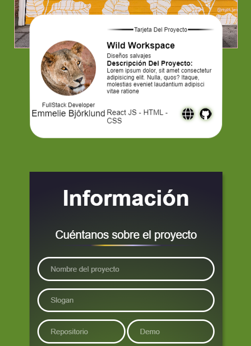
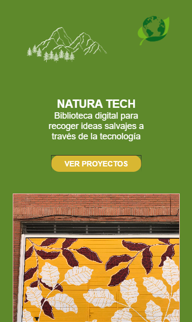

# Este equipo mola un huevo! 🙃

# 🌿 NATURA TECH: Biblioteca digital

## Descripción del Proyecto

Bienvenidos a nuestra aplicación dedicada a impulsar proyectos relacionados con la naturaleza, el mundo sostenible y la tecnología digital.

Nuestra herramienta está diseñada para ayudar a cualquier persona con una visión verde a comunicar sus ideas de manera efectiva, todo ello utilizando la tecnología como aliada para alcanzar estos objetivos.

Nuestra aplicación facilita la creación rápida y sencilla de tarjetas de proyectos. Desarrollada con un enfoque Mobile First, garantiza una experiencia óptima en dispositivos móviles. Los usuarios pueden ingresar información sobre el proyecto, que incluye nombre, slogan, tecnologías utilizadas, enlaces al repositorio y demo, descripción, nombre y trabajo del autor/a, y fotos del proyecto y autor/a. Las modificaciones en el formulario se reflejan automáticamente en una vista previa de la tarjeta. Además, la información se almacena en localStorage para persistencia, y al hacer clic en "Crear Tarjeta", se genera una URL para compartir la tarjeta con otros usuarios.

 

## Tecnologías Utilizadas

Para lograr los objetivos del proyecto y desarrollar la aplicación, utilizamos las siguientes tecnologías y técnicas:

- **React:** Utilizamos React para estructurar la aplicación en componentes, lo que nos permite crear una interfaz de usuario dinámica y reutilizable.
- **React Router:** Empleamos React Router para manejar la navegación dentro de la aplicación, facilitando la transición entre diferentes vistas y páginas.
- **Hooks para las peticiones al servidor:** Utilizamos hooks de React para realizar peticiones al servidor y obtener o enviar datos, lo que nos permitió interactuar con APIs externas de manera eficiente.
- **Uso de props para pasar datos a componentes hijos:** Utilizamos props para pasar datos, lo que nos permitió compartir información y mantener un flujo de datos unidireccional en la aplicación.
- **Uso de eventos en React para atender a interacciones del usuario:** Implementamos eventos en React para manejar interacciones del usuario, como clics de botones o cambios en formularios, permitiendo una experiencia de usuario interactiva y fluida.
- **Utilización de métodos funcionales de array (map, filter, etc.):** Empleamos métodos funcionales de array como map y filter para manipular y transformar datos de manera eficiente.
- **Validación de props utilizando defaultProps y propTypes:** Utilizamos defaultProps y propTypes para validar y definir valores por defecto para props en nuestros componentes React.
